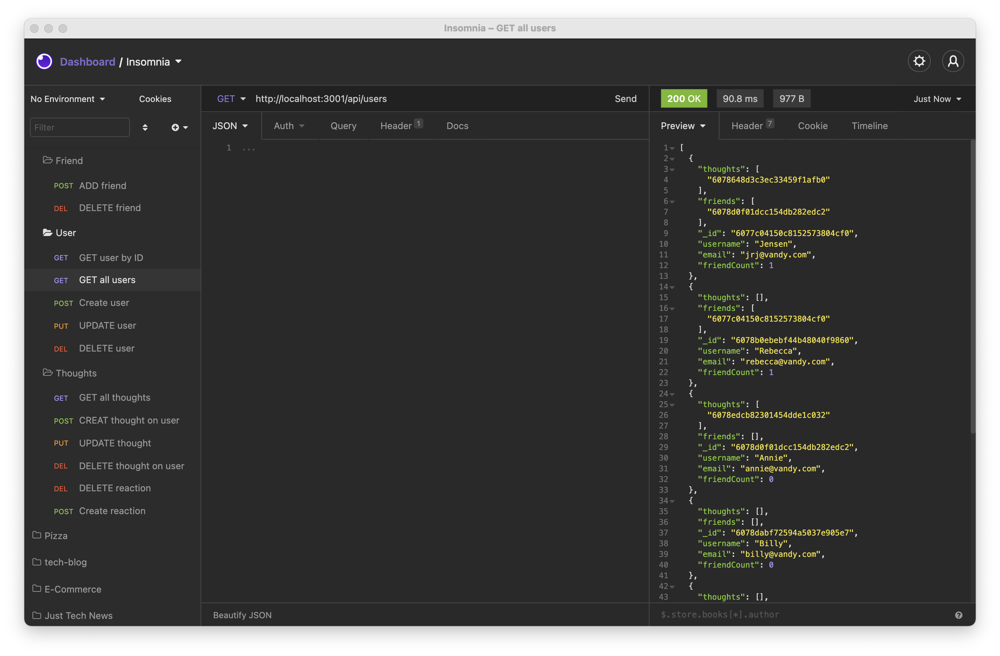
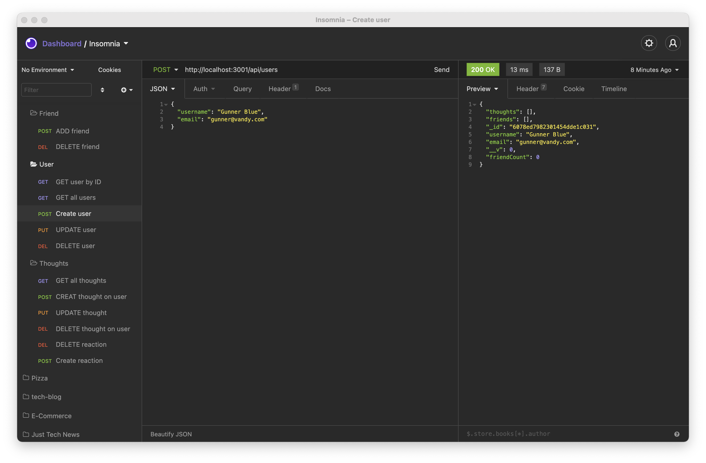

# SOCIAL NETWORK API

## Description 

build an API for a social network using Express.js for routing, a MongoDB database, and the Mongoose ODM. In addition to using the [Express](https://www.npmjs.com/package/express) and [Mongoose](https://www.npmjs.com/package/mongoose) packages, you may also optionally use a JavaScript date library of your choice or the native JavaScript `Date` object to format timestamps.

---

## Table of Contents 

- [Website](#website)
- [Built With](#built-with)
- [Usage](#usage)
- [Contributors](#contributors)

---

## Website

https://github.com/jrjensen14/social-network-api.git

---

## Built With

- Mongoose
- Express
- Javascript

[Back to Contents](#table-of-contents)

---

## Usage
* Walk Through Video:
https://drive.google.com/file/d/1XHmQWXbs69uQ0uG9_pOyaj7L0oqVolfO/view

[Back to Contents](#table-of-contents)

---

## Contributors

---
    
Jessica Jensen
    
[jrjensen14](https://github.com/jrjensen14)

---

[Back to Contents](#table-of-contents)

